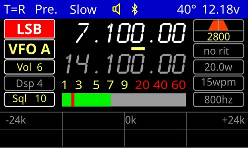

# FX-4CR-V2 firmware
 
This is totally new firmware for the FX-4CR radio. 
Due to a hardware change this version will not be flashed on radios delivered after January 2024. 
Updates will allow this later. 

## Attention
Only use this firmware if you are comfortable with the technique. 
Read and understand the technical manual. 
Note all the values of the different menus, user and technical. 
The contents of the EEPROM memory are erased. 
If you want to be able to return to official firmware you will have to re-enter the values noted previously.

## Installing
Download the latest firmware and flash it. 
Before you start using the radio in transmission, you must perform an alignment. 
Follow the procedure in the service manual.

## Usage
Please read the user manual. 
There are some changes in functions. 
Keep in mind that this is the first public release and there may be some setbacks. 
This version should be considered a beta.

73 by Daniel, F5BUD
